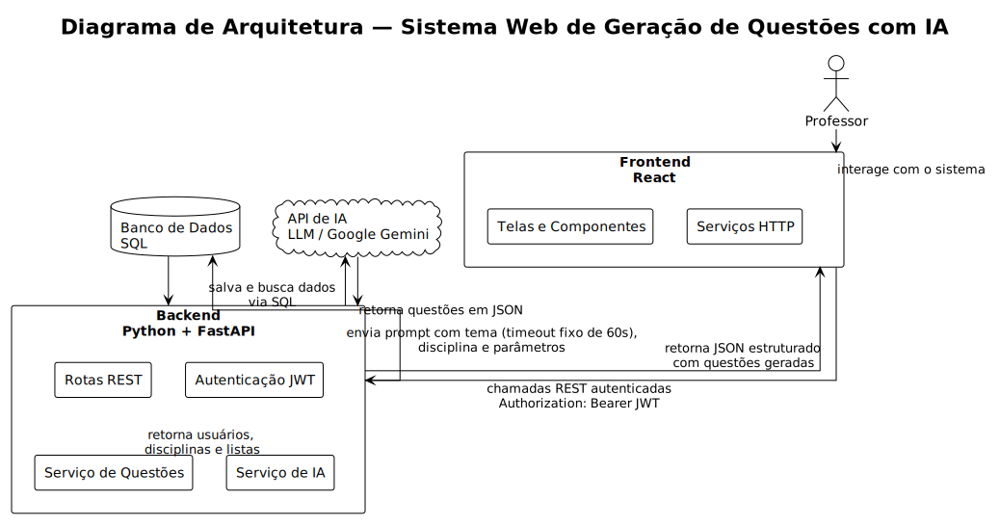

# Plano de Execução 


## 1. Identificação do Projeto

**Nome do sistema:** 

**Tema:** Gerador de listas de exercícios com apoio de Inteligência Artificial

**Disciplina:** Desenvolvimento de Sistema Web com IA para Apoio à Educação Básica

**Integrantes da dupla:**

* Integrante 1:
* Integrante 2:

---

## 2. Descrição do Problema

Professores da educação básica frequentemente precisam preparar listas de exercícios para diferentes turmas, disciplinas, anos escolares e níveis de dificuldade. Esse processo pode ser repetitivo e consumir muito tempo, principalmente quando o professor precisa adaptar as atividades para conteúdos específicos ou para turmas com diferentes níveis de aprendizagem.

Além disso, muitas vezes o professor precisa criar questões com alternativas, gabarito e explicações, o que exige planejamento e revisão. Quando há pouco tempo disponível, a criação desse material pode se tornar trabalhosa e limitar a variedade das atividades oferecidas aos alunos.

O AI busca apoiar esse processo por meio de um sistema web que permite ao professor gerar listas de exercícios personalizadas com auxílio de IA. O professor informa dados como disciplina, ano escolar, assunto, quantidade de questões, dificuldade e observações. A IA gera uma lista estruturada com enunciados, alternativas, resposta correta e explicação. Depois disso, o professor pode revisar, editar e salvar a lista para uso posterior.

---

## 3. Usuários-Alvo

### 3.1 Usuário Principal

O usuário principal do sistema é o **professor da educação básica**, especialmente professores que precisam preparar atividades, revisões, exercícios de fixação ou avaliações simples para suas turmas.

### 3.2 Necessidades do Usuário

O professor precisa:

* Criar listas de exercícios de forma rápida;
* Personalizar as questões por disciplina, assunto, ano escolar e dificuldade;
* Receber questões com gabarito e explicação;
* Revisar o conteúdo gerado antes de salvar;
* Armazenar listas já criadas para reutilização;
* Consultar listas antigas quando necessário.

---

## 4. Objetivo do Sistema

O objetivo do projeto é oferecer uma ferramenta simples e funcional para auxiliar professores na criação de listas de exercícios personalizadas, utilizando IA para gerar questões educacionais a partir de parâmetros definidos pelo próprio professor.

O sistema não tem como objetivo substituir o trabalho pedagógico do professor. A IA será usada como apoio inicial para geração de conteúdo, mas o professor continuará responsável por revisar, editar e validar as questões antes de utilizá-las com os alunos.

---

## 5. Escopo do Projeto

O projeto terá um escopo pequeno e funcional, priorizando a entrega completa das funcionalidades principais. O sistema será desenvolvido como uma aplicação web com frontend em React, backend em FastAPI, banco de dados com SQL e autenticação JWT.

### 5.1 Funcionalidades Dentro do Escopo

O sistema deverá permitir:

1. Cadastro de professor;
2. Login de professor;
3. Autenticação com JWT;
4. Criação de uma lista de exercícios com apoio de IA;
5. Exibição de uma prévia da lista gerada;
6. Edição manual das questões antes de salvar;
7. Salvamento da lista no banco de dados;
8. Listagem das listas criadas pelo professor logado;
9. Visualização dos detalhes de uma lista;
10. Exclusão de uma lista salva;
11. Proteção das rotas de acesso a dados do professor;
12. Documentação básica de instalação, execução e uso.

### 5.2 Funcionalidades Fora do Escopo Inicial

As seguintes funcionalidades não farão parte do escopo principal e só serão consideradas caso sobre tempo:

* Exportação em PDF;
* Upload de arquivos.

A decisão de deixar essas funcionalidades fora do escopo inicial tem como objetivo manter o projeto viável dentro do tempo disponível e garantir que o fluxo principal seja entregue com qualidade.

---

## 6. Descrição Geral do Funcionamento

O fluxo principal do sistema será:

1. O professor acessa o sistema;
2. O professor cria uma conta ou faz login;
3. O sistema direciona o professor para o dashboard;
4. O professor clica em “Nova Lista”;
5. O professor preenche um formulário com:
* Disciplina;
* Ano escolar;
* Assunto;
* Quantidade de questões;
* Nível de dificuldade;
* Tipo de questão;
* Observações opcionais;


6. O sistema envia esses dados ao backend;
7. O backend monta um prompt e chama a API ou biblioteca de IA;
8. A IA retorna uma lista estruturada;
9. O sistema mostra uma prévia da lista ao professor;
10. O professor revisa e, se necessário, edita o conteúdo;
11. O professor salva a lista;
12. A lista fica armazenada e pode ser consultada posteriormente.

---

## 7. Funcionalidade de Inteligência Artificial

### 7.1 Descrição da IA

A funcionalidade de IA será usada para gerar automaticamente listas de exercícios a partir das informações fornecidas pelo professor.

A IA receberá dados como:

* Disciplina;
* Ano escolar;
* Assunto;
* Quantidade de questões;
* Dificuldade;
* Tipo de questão;
* Observações adicionais.

Com base nesses dados, a IA deverá retornar uma lista de exercícios contendo:

* Título da lista;
* Enunciados das questões;
* Alternativas, quando o tipo for múltipla escolha;
* Resposta correta;
* Explicação resumida do gabarito.

### 7.2 Encaixe da IA no Fluxo do Usuário

A IA estará integrada diretamente ao fluxo principal do sistema. Ela não será uma tela separada de conversa ou um chatbot genérico. O professor usará a IA dentro da tela de criação de lista.

O fluxo será:

1. Professor preenche o formulário;
2. Professor clica em “Gerar com IA”;
3. Sistema gera a lista;
4. Professor revisa o resultado;
5. Professor edita se necessário;
6. Professor salva a lista.

Assim, a IA agrega valor real ao sistema, pois reduz o tempo necessário para criar materiais didáticos.

### 7.3 Exemplos de Prompt para a IA

```text
Você é um assistente educacional para professores da educação básica.

Gere uma lista de exercícios com as seguintes características:

Disciplina: Matemática
Ano escolar: 7º ano
Assunto: Frações
Quantidade de questões: 5
Dificuldade: Média
Tipo de questão: Múltipla escolha
Observações: Use exemplos simples do cotidiano.

Retorne apenas um JSON válido no seguinte formato:

{
  "titulo": "Lista de exercícios sobre frações",
  "questoes": [
    {
      "enunciado": "...",
      "alternativas": ["A) ...", "B) ...", "C) ...", "D) ..."],
      "resposta_correta": "A",
      "explicacao": "..."
    }
  ]
}

```

```text
Você é um assistente educacional especializado em apoiar professores da educação básica.

Gere uma lista de exercícios com as seguintes características:

Disciplina: História
Ano escolar: 9º ano
Assunto: Segunda Guerra Mundial
Quantidade de questões: 3
Dificuldade: Difícil
Tipo de questão: Aberta (Discursiva)
Observações: Exija que o aluno relacione causas econômicas e sociais na formulação da resposta.

Retorne apenas um JSON válido no seguinte formato:

{
  "titulo": "Lista de exercícios discursivos sobre a Segunda Guerra Mundial",
  "questoes": [
    {
      "enunciado": "...",
      "resposta_esperada": "...",
      "criterios_de_correcao": [
        "O aluno deve mencionar o fator X...", 
        "O aluno deve relacionar com o evento Y..."
      ]
    }
  ]
}
```

### 7.4 Cuidados com a IA

Como a IA pode gerar respostas incorretas, incompletas ou em formato inadequado, o sistema deverá:

* Exibir a lista para revisão antes de salvar;
* Permitir edição manual;
* Tratar erro caso a IA não retorne um formato válido;
* Informar ao usuário quando a geração falhar;
* Não salvar automaticamente uma lista sem revisão do professor.

---

## 8. Entidades do Sistema

### 8.1 User

Representa o professor cadastrado no sistema.

Campos previstos:

| Campo | Tipo | Descrição |
| --- | --- | --- |
| id | int | Identificador único do usuário |
| name | string | Nome do professor |
| email | string | E-mail usado para login |
| password_hash | string | Senha criptografada |
| created_at | datetime | Data de criação da conta |

Relacionamentos:

* Um usuário pode ter várias listas de exercícios.

---

### 8.2 ExerciseList

Representa uma lista de exercícios criada pelo professor.

Campos previstos:

| Campo | Tipo | Descrição |
| --- | --- | --- |
| id | int | Identificador único da lista |
| title | string | Título da lista |
| subject | string | Disciplina |
| school_year | string | Ano escolar |
| topic | string | Assunto da lista |
| difficulty | string | Nível de dificuldade |
| question_type | string | Tipo de questão |
| quantity | int | Quantidade de questões |
| user_id | int | Professor dono da lista |
| created_at | datetime | Data de criação |
| updated_at | datetime | Data da última atualização |

Relacionamentos:

* Uma lista pertence a um usuário;
* Uma lista possui várias questões.

---

### 8.3 Question

Representa uma questão pertencente a uma lista de exercícios.

Campos previstos:

| Campo | Tipo | Descrição |
| --- | --- | --- |
| id | int | Identificador único da questão |
| exercise_list_id | int | Lista à qual a questão pertence |
| statement | string | Enunciado da questão |
| alternatives | string/json | Alternativas da questão |
| correct_answer | string | Resposta correta |
| explanation | string | Explicação do gabarito |
| order | int | Ordem da questão na lista |

Relacionamentos:

* Uma questão pertence a uma lista de exercícios.

---

## 9. Requisitos Funcionais

### RF01 — Cadastro de Professor

O sistema deve permitir que um professor crie uma conta informando nome, e-mail e senha.

### RF02 — Login

O sistema deve permitir que o professor faça login usando e-mail e senha.

### RF03 — Autenticação JWT

O sistema deve gerar um token JWT após o login e usar esse token para proteger as rotas privadas.

### RF04 — Criar Lista com IA

O sistema deve permitir que o professor informe os dados da lista e gere questões automaticamente com apoio de IA.

### RF05 — Prévia da Lista Gerada

O sistema deve mostrar a lista gerada antes de salvá-la no banco de dados.

### RF06 — Editar Questões Geradas

O sistema deve permitir que o professor edite enunciados, alternativas, resposta correta e explicações antes de salvar.

### RF07 — Salvar Lista

O sistema deve permitir que o professor salve a lista de exercícios no banco de dados.

### RF08 — Listar Listas Salvas

O sistema deve exibir todas as listas criadas pelo professor autenticado.

### RF09 — Visualizar Detalhes da Lista

O sistema deve permitir que o professor visualize todas as informações de uma lista salva.

### RF10 — Excluir Lista

O sistema deve permitir que o professor exclua uma lista que ele criou.

### RF11 — Controle de Acesso

O sistema deve impedir que um professor visualize, edite ou exclua listas de outro professor.

---

## 10. Requisitos Não Funcionais

### RNF01 — Organização do Código

O frontend e o backend devem ser organizados em múltiplos arquivos e pastas, separando responsabilidades.

### RNF02 — Interface Responsiva

A interface deve funcionar adequadamente em telas de notebook e desktop.

### RNF03 — Usabilidade

O sistema deve apresentar mensagens claras de carregamento, sucesso e erro.

### RNF04 — Segurança

Senhas devem ser armazenadas com hash, e as chaves de API devem ser mantidas em variáveis de ambiente.

### RNF05 — Persistência

As listas salvas devem permanecer disponíveis mesmo após o usuário sair do sistema.

### RNF06 — Tratamento de Erros

O backend deve retornar códigos HTTP adequados e mensagens de erro compreensíveis.

### RNF07 — Documentação

O repositório deve conter um README com instruções para instalar e executar o frontend e o backend.

---

## 11. Telas Principais

### 11.1 Tela de Login

Campos:

* E-mail;
* Senha.

Ações:

* Entrar;
* Ir para cadastro.

---

### 11.2 Tela de Cadastro

Campos:

* Nome;
* E-mail;
* Senha;
* Confirmação de senha.

Ações:

* Criar conta;
* Voltar para login.

---

### 11.3 Dashboard

Elementos:

* Saudação ao professor;
* Quantidade de listas criadas;
* Botão para criar nova lista;
* Atalho para listas recentes.

---

### 11.4 Tela de Gerar Lista

Campos:

* Disciplina;
* Ano escolar;
* Assunto;
* Dificuldade;
* Quantidade de questões;
* Tipo de questão;
* Observações opcionais.

Ações:

* Gerar com IA;
* Limpar formulário.

---

### 11.5 Tela de Prévia da Lista

Elementos:

* Título gerado;
* Lista de questões;
* Alternativas;
* Resposta correta;
* Explicação;
* Campos editáveis.

Ações:

* Salvar lista;
* Gerar novamente;
* Cancelar.

---

### 11.6 Tela Minhas Listas

Elementos:

* Cards ou tabela com listas salvas;
* Título;
* Disciplina;
* Assunto;
* Ano escolar;
* Dificuldade;
* Data de criação.

Ações:

* Abrir detalhes;
* Excluir lista.

---

### 11.7 Tela de Detalhes da Lista

Elementos:

* Informações gerais da lista;
* Questões completas;
* Gabarito;
* Explicações.

Ações:

* Voltar;
* Excluir;
* Copiar conteúdo, caso seja implementado.

---

## 12. Stack Tecnológica

### 12.1 Diagrama



### 12.2 Frontend

* React;
* Vite;
* Tailwind CSS ou Bootstrap;
* Axios para requisições HTTP;
* React Router para navegação;
* useState e useEffect para gerenciamento básico de estado.

### 12.3 Backend

* Python;
* FastAPI;
* SQLModel;
* Pydantic;
* JWT para autenticação;
* Passlib ou bcrypt para hash de senha;
* Uvicorn para execução local.

### 12.4 Banco de Dados

Durante o desenvolvimento, será usado SQL.

### 12.5 Inteligência Artificial

A integração de IA poderá ser feita com uma API de modelo de linguagem ou biblioteca compatível. A chave de acesso será armazenada em variável de ambiente e nunca será enviada ao repositório.

---

## 13. Protótipo de Estrutura Inicial do Repositório

```text
ai/
  README.md
  plano.md
  frontend/
    src/
      components/
        Button.jsx
        Input.jsx
        ExerciseListCard.jsx
        QuestionCard.jsx
        LoadingMessage.jsx
        ErrorMessage.jsx
      pages/
        Login.jsx
        Register.jsx
        Dashboard.jsx
        GenerateList.jsx
        PreviewList.jsx
        MyLists.jsx
        ListDetails.jsx
      services/
        api.js
        authService.js
        exerciseService.js
        aiService.js
      hooks/
        useAuth.js
      App.jsx
      main.jsx
  backend/
    app/
      main.py
      database.py
      config.py
      models/
        user.py
        exercise_list.py
        question.py
      schemas/
        user_schema.py
        exercise_schema.py
        ai_schema.py
      routers/
        auth.py
        exercise_lists.py
        ai.py
      auth/
        security.py
        dependencies.py
      services/
        ai_service.py
    requirements.txt
    .env.example

```

---

## 14. Rotas Previstas da API

### Autenticação

```text
POST /auth/register
POST /auth/login
GET /auth/me

```

### Listas de Exercícios

```text
GET /exercise-lists
POST /exercise-lists
GET /exercise-lists/{list_id}
PUT /exercise-lists/{list_id}
DELETE /exercise-lists/{list_id}

```

### Inteligência Artificial

```text
POST /ai/generate-exercise-list

```

---

## 15. Dados Mockados para a Sprint 2

Durante a Sprint 2, antes da integração com o backend, o frontend usará dados mockados semelhantes aos seguintes:

```javascript
const mockExerciseLists = [
  {
    id: 1,
    title: "Lista de Frações",
    subject: "Matemática",
    schoolYear: "7º ano",
    topic: "Frações",
    difficulty: "Média",
    quantity: 5,
    createdAt: "2026-06-02",
    questions: [
      {
        id: 1,
        statement: "Qual é o resultado de 1/2 + 1/4?",
        alternatives: ["A) 1/4", "B) 2/4", "C) 3/4", "D) 4/4"],
        correctAnswer: "C",
        explanation: "1/2 equivale a 2/4. Portanto, 2/4 + 1/4 = 3/4."
      }
    ]
  }
];

```

---

## 16. Planejamento por Sprint

## Sprint 1 — Proposta e Protótipo Visual

**Período de desenvolvimento:** 26/05

**Review:** 01/06

**Foco:** definição do problema e prototipação da interface.

### Entregáveis

* Arquivo `plano.md` finalizado no repositório;
* Protótipo visual das telas principais;
* Pitch objetivo do projeto.

### Atividades

* Definir nome do sistema;
* Definir problema e usuários-alvo;
* Definir entidades principais;
* Definir funcionalidade de IA;
* Desenhar fluxo principal do usuário;
* Criar protótipo das telas:
* Login;
* Cadastro;
* Dashboard;
* Gerar lista;
* Prévia da lista;
* Minhas listas;
* Detalhes da lista;


* Revisar escopo para evitar funcionalidades excessivas;
* Preparar pitch de até 5 minutos.

### Divisão de tarefas

Ambos os integrantes deverão entender todo o projeto.

---

## Sprint 2 — Frontend com Dados Mockados

**Período de desenvolvimento:** 02/06

**Review:** 08/06

**Foco:** interface funcional em React com dados mockados.

### Entregáveis

* Interface funcionando no navegador;
* Dados mockados verossímeis;
* Formulário com feedback visual;
* Listagem de listas;
* Componentes reutilizáveis;
* Gerenciamento de estado com useState ou equivalente.

### Atividades

* Criar projeto React com Vite;
* Configurar Tailwind CSS ou Bootstrap;
* Criar estrutura de pastas do frontend;
* Implementar tela de login visual;
* Implementar tela de cadastro visual;
* Implementar dashboard;
* Implementar formulário de geração de lista;
* Criar validações básicas no formulário;
* Criar estados de carregamento, erro e sucesso;
* Criar tela de prévia da lista;
* Criar listagem de listas com dados mockados;
* Criar tela de detalhes;
* Separar componentes reutilizáveis;
* Preparar demonstração da interface.

### Divisão preliminar de tarefas

Ambos devem testar todas as telas e compreender o funcionamento geral do frontend.

---

## Sprint 3 — Backend, Banco de Dados e IA

**Período de desenvolvimento:** 09/06

**Review:** 15/06

**Foco:** API funcional integrada ao frontend, persistência real e IA funcionando.

### Entregáveis

* Backend em FastAPI;
* Banco de dados com SQLModel;
* Autenticação JWT;
* Integração real entre frontend e backend;
* Funcionalidade de IA operando de ponta a ponta;
* Rotas protegidas;
* Dados mockados substituídos por dados reais da API.

### Atividades

* Criar projeto FastAPI;
* Configurar SQLModel;
* Criar conexão com banco de dados;
* Criar modelo User;
* Criar modelo ExerciseList;
* Criar modelo Question;
* Criar schemas Pydantic;
* Implementar cadastro de usuário;
* Implementar login;
* Implementar geração e validação de JWT;
* Proteger rotas privadas;
* Implementar CRUD de listas;
* Implementar rota de geração de lista com IA;
* Criar serviço responsável por montar o prompt da IA;
* Validar o retorno da IA;
* Integrar frontend com API real;
* Tratar erros no frontend;
* Testar o fluxo completo:
* cadastrar;
* logar;
* gerar lista;
* revisar;
* salvar;
* listar;
* abrir detalhes;
* excluir.


### Divisão preliminar de tarefas

Ambos devem revisar o código do outro e conseguir explicar todos os endpoints principais.

---

## Sprint 4 — Testes, Hospedagem e Documentação

**Período de desenvolvimento:** 16/06

**Review:** 22/06

**Foco:** qualidade, testes, deploy e documentação.

### Entregáveis

* Sistema acessível por URL pública;
* Frontend em produção;
* Backend em produção;
* Testes documentados;
* README completo;
* Manual do usuário;
* Variáveis de ambiente configuradas corretamente;
* Nenhuma chave exposta no repositório.

### Atividades

* Corrigir erros encontrados na Sprint 3;
* Criar testes manuais documentados;
* Testar fluxo principal completo;
* Testar erros comuns:
* login inválido;
* campos obrigatórios vazios;
* falha na geração por IA;
* acesso sem token;
* tentativa de acessar lista inexistente;


* Fazer deploy do frontend;
* Fazer deploy do backend;
* Configurar variáveis de ambiente;
* Criar `.env.example`;
* Atualizar README com instruções de instalação e execução;
* Escrever manual do usuário;
* Preparar apresentação final de até 5 minutos.

### Divisão preliminar de tarefas

Ambos devem participar do deploy, dos testes e da apresentação final.

---

## 17. Critérios de Aceitação do MVP

O projeto será considerado funcional se:

* O professor conseguir criar uma conta;
* O professor conseguir fazer login;
* O sistema armazenar o token JWT;
* O professor conseguir gerar uma lista usando IA;
* O professor conseguir visualizar a prévia da lista;
* O professor conseguir salvar a lista;
* O professor conseguir visualizar suas listas salvas;
* O professor conseguir abrir os detalhes de uma lista;
* O professor conseguir excluir uma lista;
* O professor não conseguir acessar listas de outro usuário;
* O sistema estiver organizado em frontend e backend separados;
* O README explicar como rodar o projeto.

---

## 18. Testes Planejados

### Testes Manuais

| Caso de Teste | Ação | Resultado Esperado |
| --- | --- | --- |
| Cadastro válido | Informar nome, e-mail e senha válidos | Conta criada com sucesso |
| Cadastro com e-mail repetido | Usar e-mail já cadastrado | Sistema mostra erro |
| Login válido | Informar e-mail e senha corretos | Sistema redireciona para dashboard |
| Login inválido | Informar senha errada | Sistema mostra erro |
| Gerar lista válida | Preencher todos os campos e clicar em gerar | Sistema mostra prévia da lista |
| Gerar lista sem assunto | Deixar assunto vazio | Sistema pede preenchimento |
| Salvar lista | Gerar lista e clicar em salvar | Lista aparece em minhas listas |
| Abrir detalhes | Clicar em uma lista salva | Sistema mostra questões e gabarito |
| Excluir lista | Clicar em excluir | Lista é removida |
| Acesso sem login | Tentar acessar página protegida | Sistema redireciona para login |

---

## 19. Riscos e Estratégias de Mitigação

### Risco 1 — IA retornar dados em formato inválido

**Impacto:** o sistema pode não conseguir exibir ou salvar a lista.

**Mitigação:** solicitar resposta em JSON, validar o retorno no backend e exibir mensagem de erro caso a geração falhe.

### Risco 2 — Escopo crescer demais

**Impacto:** funcionalidades principais podem ficar incompletas.

**Mitigação:** manter o foco no MVP e deixar recursos extras fora do escopo inicial.

### Risco 3 — Problemas com autenticação JWT

**Impacto:** rotas protegidas podem falhar ou ficar inseguras.

**Mitigação:** implementar autenticação no início da Sprint 3 e testar antes de integrar todas as rotas.

### Risco 4 — Problemas no deploy

**Impacto:** sistema pode não ficar acessível em URL pública.

**Mitigação:** iniciar o deploy antes do último dia da Sprint 4 e manter instruções de execução local funcionando.

### Risco 5 — Chave de API exposta

**Impacto:** risco de segurança e uso indevido da chave.

**Mitigação:** usar variáveis de ambiente e nunca salvar arquivos `.env` no GitHub.

---

## 20. Pitch do Projeto

O projeto é um sistema web para auxiliar professores da educação básica na criação de listas de exercícios personalizadas. O professor informa a disciplina, o ano escolar, o assunto, a quantidade de questões e o nível de dificuldade. A partir desses dados, a IA gera uma lista estruturada com enunciados, alternativas, gabarito e explicações. O professor pode revisar, editar e salvar a lista para reutilizar posteriormente. O sistema reduz o tempo gasto na preparação de atividades e oferece um apoio prático ao trabalho docente.

---

## 21. Conclusão

O projeto foi planejado para ser um sistema pequeno, funcional e viável dentro do prazo da disciplina. O foco está em entregar um fluxo principal completo: cadastro, login, geração de lista com IA, revisão, salvamento e consulta posterior. A proposta atende a uma necessidade real de professores da educação básica e utiliza Inteligência Artificial como apoio direto ao processo de criação de materiais didáticos.
